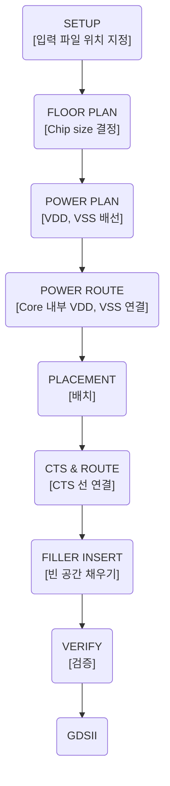

## Flowchart

```mermaid
graph TD
  1("SETUP 
  [입력 파일 위치 지정]") --> 2("FLOOR PLAN 
  [Chip size 결정]")

  2 --> 3("POWER PLAN
  [VDD, VSS 배선]") --> 4("POWER ROUTE
  [Core 내부 VDD, VSS 연결]") --> 5("PLACEMENT
  [배치]") --> 6("CTS & ROUTE
  [CTS 선 연결]") --> 7("FILLER INSERT
  [빈 공간 채우기]") --> 8("VERIFY
  [검증]") --> 9("GDSII")
```

