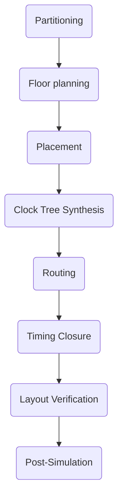

### Auto P&R 개요
##### Auto P&R 수행
1. Netlist는 게이트들이 어떻게 연결되었는지를 나타낸다.
2. P&R에서는 반도체 다이 위에 어떻게 배치(place)하고, 게이트 간의 연결을 해주는 와이어를 어떻게 놓을지(route)를 결정한다.

_과정에 대해서 말해보면
1.주어진 **논리 회로를 물리적인 위치에 배치**하고, **신호가 흐르는 경로를 선정**합니다.
2.라우팅 단계에서 신호가 최적의 경로로 흐를 수 있도록 **회로의 연결을 최적화**합니다.
3.이후에는 **레이아웃 디자인을 최적화**하고. 결과를 설계자의 **의도와 맞는지 다시 검증**하고 제품을 제작합니다._

##### File format
**Input**
- Netlist : Design Netlist - Verilog File _소스파일_
- SDC : Constraint File _in/out put delay, Clock 정보_
- LEF : Physical Libraries _width, length 등의 정보 포함_
- LIB : Timing Libraries _gate가 어떻게 동작하는 지, 테스트 환경 예) 남극, 사막의 기후_

**Output**
- GDS : Physical Layout
- Netlist : CTS를 거치면서 input netlist를 비교해 달라짐
- SDF : Standard Delay Format

##### Place and Route flowchart

#### CTS(Clock Tree Synthesis)
1. **클럭 노드 선정** : 클럭 신호의 발생 지점과 도달 지점 선택
2. **클럭 경로 생성** : 클럭 노드 사이에 경로를 생성
3. **클럭 노드 배치** : 경로에 따라 클럭 노드를 배치
4. **클럭 트리 라우팅** : 클럭 노드 사이에 라우팅을 수행
CTS : 모든 회로 노드에서 클럭 신호를 동일한 시간에 받을 수 있도록 하여 회로의 안정성과 성능을 보장.
==Clock Skew를 줄여주기 위함==

### Placement
1. 물리적 레이아웃 디자인의 첫 번째 단계로 각 구성 요소(게이트, 레지스터, 메모리 등)의 위치를 지정한다.
2. Placement 단계에서는 디자인 크기, 전원 및 신호 노이즈, 레이아웃의 외형 등 다양한 요소를 고려하여 각 구성 요소를 최적의 위치에 배치한다.
3. Auto P&R에서 Placement는 배치된 요소들의 위치를 최적화하고, 가능한 모든 배치 옵션을 고려하여 회로의 기능을 유지하면서 최적의 레이아웃을 생성한다.
4. 이후 Routing 단계에서 사용되며, 회로의 성능과 에너지 효율성에 큰 영향을 미친다.

### Routing
1. Placement 단계에서 배치된 각 구성 요소 간에 연결되는 전선 경로를 생성하는 과정
2. 전선 경로를 생성하는 데 필요한 물리적 제약 조건과 기능적 요구 사항을 고려하여 최적의 경로를 생성
3. Auto P&R에서 Routing은 전선이 교차하는 것을 최소화하거나 노이즈를 줄이기 위해 전선의 길이를 최소화하거나 균등하게 분포시키는 등의 최적화 기술이 사용된다.
4. 전선이 겹치거나 다른 전선과 충돌하는 경우 이를 해결하기 위해 전선을 조정하거나 다른 경로로 전선을 이동하는 등의 작업을 수행
5. Routing 단계에서 생성된 전선 경로는 회로의 신호 전달 및 에너지 효율성에 큰 영향을 미치므로, Auto P&R에서는 최적의 Routing 경로를 생성하는 것이 중요하므로, 이를 위해 다양한 최적화 기술과 Routing Algorithm이 사용
   - 시작점에서부터 거리 계산, 시작점은 0, 나머지는 무한대로 초기화
   - 방문하지 않은 노드 중에서 거리가 가장 작은 노드를 선택
   - 선택된 노드에 인접한 노드들의 거리를 갱신, 이때 거리는 시작점부터 선택된 노드까지의 거리와 선택된 노드에서 인접한 노드까지의 거리를 더한 값.
   - 목적지 노드가 선택될 때까지 위 단계를 반복.
[[3장 휘갈기기#9.3.3 다익스트라 알고리즘 (Dijkstra's Algorithm)]]
_이건 내가 봤던 다익스트라 알고리즘 같다.  
TIM : priority_queue를 사용해서 다익스트라 알고리즘을 구상하면 Time Complexity를 효율적으로 만들 수 있다. 다익스트라 알고리즘은 대표적인 Greedy Algorithm인데 항상 최선의 선택을 한다. 그래서 새로운 경로가 더 좋은 경로가 되면 그걸 Update 하면서 최적의 경로를 찾는다. 
근데 일반 queue를 사용하면 이걸 계속 반복하고 비교하면서 수많은 연산이 이루어진다. 하지만 실무에서 그냥 queue를 쓰는 경우는 없다.
priority_queue는 모든 경로를 INFINITY로 두고, 인접한 노드들을 조사하고 최소값을 꺼내는 방식을 사용한다. 매번 반복문으로 직접 찾지 않고 그냥 꺼내면 되기에, 가까운 정점에 대해서 하나씩 확정한다. _ 

### Optimization
1. **회로의 성능 최적화** : Auto P&R에서는 회로가 동작할 때 소비하는 **에너지, 딜레이** 등의 **성능적 요소를 최적화**한다.
2. 회로의 물리적인 **배치 및 라우팅 경로**를 최적화하여 회로의 **동작 속도를 높이고, 에너지 효율성을 높인다**.
3. **디자인 규칙 준수** : Auto P&R에서는 디자인 규칙을 준수하면서 최적화를 수행하며, 디자인 규칙은 회로를 설계할 때 지켜야 하는 물리적, 기능적 요구 사항을 의미한다. 
4. **처리 시간 최적화** : Auto P&R에서는 최적화 작업을 수행하는 동안 처리 시간을 최소화하는 것이 중요하기에, 이를 위해 **다양한 최적화 알고리즘과 기술**을 사용하여 최적화 작업을 빠르고 효율적으로 수행한다.
5. 최적화는 **회로 설계를 향상시키고, 개발 시간과 비용을 절감**하는데 도움이 되며, 다양한 성능 요구 사항을 충족시킬 수 있는 회로를 생성한다.

### Verification
1. **물리적인 배치 및 라우팅 오류 검출** : Auto P&R에서는 **물리적인 배치와 라우팅 경로에서 발생할 수 있는 오류를 검출**한다. 이를 위해 **다양한 검증 기술과 알고리즘을 사용**하여 오류를 식별하고 수정한다. 오류 검출은 회로의 안정성을 보장하는 중요한 단계이다.
2. **디자인 규칙 준수 검증** : Auto P&R에서는 디자인 규칙을 준수하였는지 검증한다. 이를 위해 디자인 규칙 검증 도구를 사용하여 **디자인 규칙에 위배되는 경우를 식별하고 수정**한다. 디자인 규칙 준수 검증은 회로의 품질을 향상시키는 중요한 작업이다.
3. **회로 시뮬레이션 및 검증** : Auto P&R에서는 회로의 동작을 시뮬레이션하여 **회로가 정확하게 동작하는지 검증**한다. 이를 위해 다양한 회로 시뮬레이션 도구를 사용하여 회로의 동작을 확인하고, 오류가 발생할 경우 수정한다. 회로 시뮬레이션은 회로가 제대로 동작할 수 있도록 보장하는 중요한 작업이다.
4. Verification을 통해 회로가 정확하게 동작하는지를 확인하고, 디자인 규칙을 준수했는지를 검증하여 회로의 품질을 향상시키는데 도움을 준다.
_DRC, LVS 이야기 추가로 다른 검증도 있나?
ERC(Electrical Rule Check), IR Drop Analysis, EM(Electromigration) Analysis, Sign-off Simulations, Antenna Effect Check 등 추가로 있다. _

