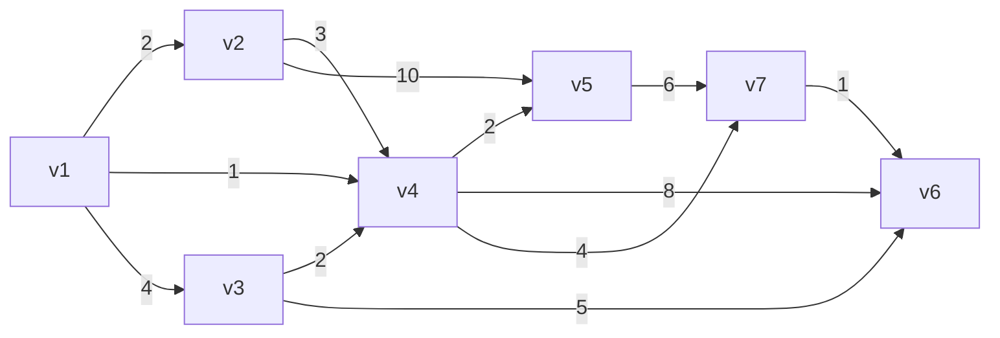
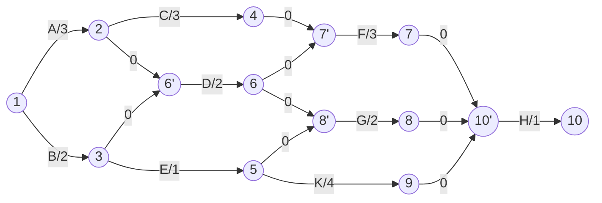

### 최단 거리 알고리즘 
입력으로 주어지는 그래프 특성과 경로의 길이를 두 가지 방식으로 측정하는 방법
1. 가중치 그래프
   각 간선에 대해서 통과할 때 드는 비용이 발생한다. 
2. 가중 경로 길이
   경로가 $v_1, v_2, \dots, v_N$ 처럼 정점을 순서대로 지나간다면, 이 경로의 가중 길이는 인접한 정점 사이의 비용을 모두 합한 값이다.
3. 비가중 경로 길이
   간선들에 부여된 비용을 고려하지 않고, 단순히 경로의 간선의 개수로 길이를 정의 하는 경우
   
#### Single-Source Shortest-Path Problem



### 단일 출발점 최단 경로 문제
경로 $(v_1, v_2, \dots, v_N)$의 비용은 다음과 같이 정의
$$[ 
\text{Cost} = \sum_{i=1}^{N-1} c_{i,i+1}  
]$$
### 9.3.1 가중치 없는 최단 경로 탐색 (Unweighted Shortest Path)

문제 정의  
- **입력:** 가중치 없는 그래프 G(V, E)와 시작 정점 s  
- **목표:** s에서 모든 다른 정점으로의 최단 경로(간선 수 기준) 구하기  
$\rightarrow$  간선 수가 최소인 경로 = 최단 경로

핵심 아이디어: BFS  
모든 간선의 비용이 같으므로, BFS를 이용하여 거리 = 몇 단계(간선)로 접근한다.

탐색 흐름:  
- 시작 정점 s는 거리 0  
- s에 인접한 정점들은 거리 1  
- 그 정점들의 이웃은 거리 2 … 계속 확장

**예시 기반 단계별 시각화**  

| 단계  | 의미           | 거리값 (dist)      |
| --- | ------------ | --------------- |
| 시작  | s만           | {s: 0}          |
| 1단계 | s의 인접 정점     | {v2, v4, v5: 1} |
| 2단계 | 위 정점들의 인접 정점 | {v3, v6, v7: 2} |
| ... | 계속 확장        |                 |

거리값 증가 → 이 과정은 BFS 그 자체이다.

**자료구조 구성**  
- `dist[v]`: 정점 v까지의 최소 간선 수  
- `known[v]`: 방문 완료 여부  
- `path[v]`: v 이전에 왔던 정점 (경로 복원용)  
초기 상태:
```
v     known    dist    path
v1    F        0       -
v2    F        INF     -
v3    F        INF     -
...
```

**기본 의사코드 (BFS)**  
다음은 가중치 없는 그래프에서 단일 출발점 최단 경로를 찾기 위한 의사코드입니다:
```cpp
void Graph::unweighted(Vertex s) {
    for each Vertex v {
        v.dist = INFINITY;
        v.known = false;
    }
    s.dist = 0;
    for(int currDist = 0; currDist < NUM_VERTICES; currDist++) {
        for each Vertex v {
            if (!v.known && v.dist == currDist) {
                v.known = true;
                for each Vertex w adjacent to v {
                    if (w.dist == INFINITY) {
                        w.dist = currDist + 1;
                        w.path = v;
                    }
                }
            }
        }
    }
}
```

이 의사코드는 가중치 없는 그래프에서 단일 출발점 최단 경로를 찾기 위한 알고리즘입니다.

1. **초기화**:
   - 모든 정점의 거리(`dist`)를 무한대(`INFINITY`)로 설정합니다.
   - 모든 정점의 방문 상태(`known`)를 `false`로 초기화합니다.
   - 시작 정점 `s`의 거리는 0으로 설정합니다.

2. **주요 루프**:
   - `currDist`는 현재 탐색 중인 거리 레벨을 나타내며, 0부터 `NUM_VERTICES - 1`까지 반복합니다.
   - 각 정점 `v`에 대해:
     - 만약 `v`가 아직 방문되지 않았고(`!v.known`), `v`의 거리가 현재 거리(`currDist`)와 같다면 (`v.dist == currDist`):
       - `v`를 방문한 것으로 표시합니다 (`v.known = true`).
       - `v`와 인접한 정점 `w`에 대해:
         - 만약 `w`의 거리가 무한대이면 (`w.dist == INFINITY`):
           - `w`의 거리를 `currDist + 1`로 설정합니다.
           - `w`의 이전 경로를 `v`로 설정합니다.

이 알고리즘은 BFS(너비 우선 탐색)의 원리를 기반으로 하며, 각 정점에서 인접한 정점을 순차적으로 탐색하여 최단 경로를 찾아내는 방식입니다.

**시간 복잡도 비교** 

| 방법       | 시간 복잡도           | 설명  |
| -------- | ---------------- | --- |
| 배열 기반    | O(\|V\|^2)       |     |
| 큐 기반 BFS | O(\|V\| + \|E\|) |     |

**결론 정리**  
가중치 없는 최단 경로 문제는 BFS로 해결 가능.  
핵심은 간선 수가 적은 경로를 레벨별로 확장하는 것.  
큐를 이용하여 시간 복잡도를 획기적으로 줄일 수 있다.
==가중치가 없을 때는 그냥 있는 경로 중에서 가장 짧은 걸 찾으면 되니까, DFS 보다 BFS가 효율적.==


### 9.3.2 개선된 BFS 의사 코드 (Queue 기반)

이 코드는 가중치 없는 그래프에서 단일 출발점 최단 경로를 찾기 위한 효율적인 의사코드입니다. 큐(Queue)를 사용하여 탐색 속도를 높이고 시간 복잡도를 줄이는 방식을 보여줍니다.

```cpp
for (int i = 0; i < N; ++i) {
    dist[i] = INF;
}
dist[start] = 0;

while (!q.empty()) {
    int v = q.front(); 
    q.pop(); 
    for (int w : adj[v]) {
        if (dist[w] == INF) {
            dist[w] = dist[v] + 1;
            q.push(w);
        }
    }
}
```

#### 코드 설명

1. **초기화**:
   - `dist` 배열을 사용하여 각 정점까지의 거리를 저장합니다.
   - 모든 정점의 거리를 무한대(`INF`)로 설정하고, 시작 정점의 거리는 0으로 초기화합니다.

2. **큐를 통한 탐색**:
   - 큐가 비어있지 않은 동안 반복합니다.
   - 현재 큐의 앞에 있는 정점 `v`를 꺼내고(`q.pop()`), `v`의 모든 인접 정점 `w`를 탐색합니다.
   - 만약 정점 `w`의 거리가 아직 무한대(`INF`)이면:
     - `w`의 거리를 `v`의 거리 + 1로 설정하여 최단 경로를 기록합니다.
     - 정점 `w`를 큐에 추가하여 다음 탐색을 준비합니다.

#### 시간 복잡도
이 알고리즘은 모든 정점과 간선을 한 번씩만 방문하므로, 시간 복잡도는 O(V + E)입니다. 여기서 V는 정점의 수, E는 간선의 수입니다. 큐를 사용함으로써 이전의 O(V²) 비효율적 접근 방식을 개선할 수 있었습니다.

이 개선된 BFS 알고리즘은 가중치가 없는 그래프에서 최단 경로를 효과적으로 찾을 수 있는 방법을 제공합니다.  

### 9.3.3 다익스트라 알고리즘 (Dijkstra's Algorithm)

다익스트라 알고리즘은 가중치가 있는 그래프의 최단 경로를 찾기 위한 알고리즘입니다. 이 알고리즘은 시작 정점으로부터 다른 모든 정점까지의 최단 경로를 구합니다.
==노드를 돌면서 해당 노드에 인접한 노드들의 가중치를 모두 확인하고, 기존에 있었던 가중치와 비교하면서 업데이트 하는 방법이구나==
_중요한 점  
다익스트라(priority queue)에서 어떻게 최단거리를 **확정** 하는가?
priority queue 에서는 하나씩 뽑기 때문에  최단이 아닌 경로는 뒤에 남아있고 최단인 경로만 root로 올라온다. 그래서 top(), pop()하면 최단 경로만 나온다
ex) (a, 1) (c, 30)인데, 나중에 cycle이라서 c의 최단 경로가 업데이트 될 거라고 가정하자. 그러면 pop()하면 (a,1)이 튀어나오고, 그 후에 연결된 노드 (b, 2), (c , 30) 이렇게 계속 나오다가 , 결국에 30보다 작은 값에서 c를 입력 받는다. 예를 들어 10이라고 하면, (c, 10), (c, 30) 이렇게 될 것이다. 그러면 pop() 하면 10이 c의 최솟값으로 확정이 되고 나중에 c가 한번 더 나오면 이미 기존 값보다 크기 때문에 if( d > dist[u]) coutinue; 같은 로직을 넣어서 무시하게끔 만든다. _
#### Vertex 구조체

다익스트라 알고리즘에서 사용되는 정점(Vertex)의 구조는 다음과 같습니다:

```cpp
struct Vertex {
    List    adj;      // 인접 리스트 (adjacency list)
    bool    known;    // 방문 여부 (visited flag)
    DistType dist;    // 시작 정점으로부터의 거리 (distance from the starting node)
    Vertex  path;     // 최단 경로를 위한 이전 정점 (previous vertex on the shortest path)
    // Add other data and member functions as needed
};
```

1. **adj (인접 리스트)**: 
   - `List adj`: 각 정점과 연결된 다른 정점들의 목록을 담고 있습니다. 인접 리스트는 그래프를 표현할 때 자주 사용되는 방식입니다.

2. **known (방문 여부)**: 
   - `bool known`: 정점이 탐색에 포함되었는지를 나타냅니다. 이 값이 `true`일 경우, 해당 정점은 이미 방문한 것입니다.

3. **dist (거리)**: 
   - `DistType dist`: 시작 정점으로부터 현재 정점까지의 최단 거리를 저장합니다. 이는 보통 `int`형으로 표현됩니다.

4. **path (이전 정점)**: 
   - `Vertex path`: 최단 경로를 추적하기 위한 요소로, 최단 경로를 만들어내기 위해 이전 정점을 가리킵니다.

#### Pseudocode 다익스트라 알고리즘

다음은 가중치 없는 그래프에서 단일 출발점 최단 경로를 찾기 위한 개선된 의사코드입니다. 큐를 사용하여 탐색 속도를 높이고 시간 복잡도를 줄이는 방식을 보여줍니다.

```cpp
void Graph::dijkstra(Vertex s) {
    for each Vertex v {
        v.dist = INFINITY;
        v.known = false;
    }
    s.dist = 0;

    while (there is an unknown distance vertex) {
        Vertex v = smallest unknown distance vertex;
        v.known = true;

        for each Vertex w adjacent to v {
            if (!w.known) {
                DistType cvw = cost of edge from v to w;
                if (v.dist + cvw < w.dist) {
                    // Update w
                    w.dist = v.dist + cvw; // 거리 업데이트
                    w.path = v; // 이전 정점 설정
                }
            }
        }
    }
}
```

#### 코드 설명

1. **초기화**:
   - 모든 정점의 거리(`dist`)를 무한대(`INFINITY`)로 설정합니다.
   - 모든 정점의 방문 상태(`known`)를 `false`로 초기화합니다.
   - 시작 정점 `s`의 거리는 0으로 설정합니다.

2. **주요 루프**:
   - 아직 거리 정보가 알려지지 않은 정점 중에서 거리 값이 가장 작은 정점 `v`를 선택합니다.
   - 이 정점 `v`를 방문한 것으로 표시합니다 (`v.known = true`).
   - `v`와 인접한 각 정점 `w`에 대해:
     - 만약 `w`가 아직 방문되지 않았다면:
       - `v`에서 `w`로 가는 간선의 비용(`cvw`)을 계산합니다.
       - `v`의 거리와 `cvw`를 합한 값이 `w`의 거리보다 작다면:
         - `w`의 거리를 업데이트합니다 (`w.dist = v.dist + cvw`).
         - `w`의 이전 정점을 `v`로 설정합니다.

이 알고리즘은 가중치가 있는 그래프에서 최단 경로를 찾는 매우 효과적인 방법입니다.
==다익스트라 알고리즘에서 거리가 확정되는 시점은 해당 노드에 접근하는 모든 간선의 경우의 수에 대해 경로를 계산 했을 때==

### 9.3.5 Acyclic Graph
Acyclic인 상태라는 것을 알고 있다면, 다익스트라 알고리즘을 개선할 수 있습니다. 정점 선택 규칙을 변경하여 위상 정렬 순서로 선택하는 것이 가능합니다. 위상 정렬이 수행되는 동안 정점 선택과 업데이트를 동시에 할 수 있기 때문에 알고리즘 전체를 한 번에 끝낼 수 있습니다. 

이러한 접근법이 효과적인 이유는 정점이 선택되면 v의 거리는 더 이상 낮아질 수 없기 때문인데, 위상 정렬 순서상 v로 들어오는 간선들 중 아직 처리되지 않은 간선이 없기 때문입니다. 또한 기존에는 어떤 정점이 다음으로 최소 거리인지 매번 찾아야 했기 때문에 priority queue가 필요했지만, DAG(Directed Acyclic Graph)에서는 위상 정렬로 정점 순서를 고려할 수 있어 O(∣E∣ + ∣V∣)의 시간 복잡도로 해결할 수 있습니다.

#### Critical Path
- **EC (Earliest Completion Time) 계산 방법**
  - **Activity-mode**: 각 노드가 작업이고, 간선은 선행/후속 관계를 나타냅니다.
  - **Event-mode**: 각 노드가 특정 시점(작업 완료 시점)을 의미하고, 간선은 작업(활동) 자체를 의미합니다.

작업들 간의 순서와 전체 프로젝트의 가장 빠른 완료 시간을 계산하기 위해 이벤트 노드로 바꿉니다. 한 이벤트가 완료되어야만 그 이후의 활동이 시작될 수 있습니다. 핵심 목표는 시작 노드부터 끝 노드까지 갈 수 있는 경로 중 가장 오래 걸리는 경로를 찾는 것입니다. 즉, 프로젝트 전체의 시간을 구하는 것입니다. 일반 그래프에서는 양수 사이클이 있으면 무한히 커질 수 있기 때문에 최장 경로 구하기가 어렵지만, 여기서는 가능합니다.

**예시**: 작업 A는 이벤트 1에서 시작해서 이벤트 2에서 끝나며 3시간이 걸립니다.

> 주의: 여러 작업이 동시에 같은 작업에 의존할 수 있습니다. 같은 선행 조건을 가진 작업이나 두 개 이상의 이전 작업이 끝나야 하는 경우가 있는데, 이때는 잘못된 연결을 피하기 위해 더미(Dummy) 간선이나 노드를 추가하여 구조를 명확하게 표현하는 방식을 사용합니다.




| Task | Duration | EST | EFT | LST | LFT | Slack | Critical |
| ---- | -------- | --- | --- | --- | --- | ----- | -------- |
| A    | 3        | 0   | 3   | 0   | 3   | 0     | ✅        |
| B    | 2        | 0   | 2   | 2   | 4   | 2     |          |
| E    | 1        | 2   | 3   | 4   | 5   | 2     |          |
| C    | 3        | 3   | 6   | 3   | 6   | 0     | ✅        |
| D    | 2        | 3   | 5   | 4   | 6   | 1     |          |
| F    | 3        | 6   | 9   | 6   | 9   | 0     | ✅        |
| G    | 2        | 3   | 5   | 7   | 9   | 4     |          |
| K    | 4        | 3   | 7   | 6   | 10  | 3     |          |
| H    | 1        | 9   | 10  | 9   | 10  | 0     | ✅        |
