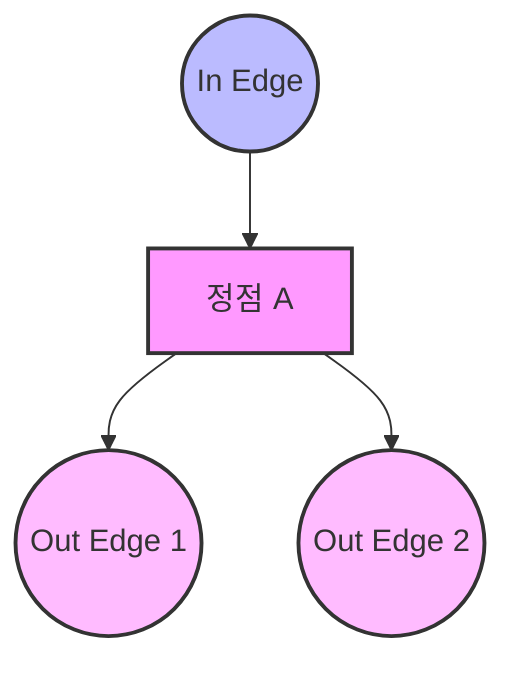

#### 정의와 용어
그래프는 G는 두 가지 요소로 구성됩니다. \( G = (V, E)\)
V = Vertices 정점의 집합
E = Edges 간선의 집합, 각 간선은 정점 쌍 (v, w)로 표현된다.

### 1. 그래프의 주요 유형
#### 방향성
**Undirected Graph : 무방향 그래프**
- 간선에 방향이 없다.
- 간선 (v, w)와 (w, v)는 동일하다.

**Directed Graph : 방향 그래프**
- 간선에 방향이 있다.
- 간선 (v, w)는 v에서 w로 가는 화살표로 표시된다.

#### 가중치
**가중치**는 각 Edge(간선)에 할당된 숫자 값. 비용, 거리, 시간, 용량 등 다양한 의미를 가질 수 있다.

**Unweighted Graph : 비가중치 그래프**
- 모든 간선의 중요도가 동일하다.

**Weighted Graph : 가중치 그래프**
- 각 간선에 비용이나 가중치가 할당된다.

### 2 기본 용어
##### Adjacent(인접) : 
두 정점이 간선으로 직접 연결되어 있을 때, 서로 인접해 있다고 말한다.
연결 = 인접이라는 건가

##### Path(경로) : 
정점의 연속된 나열? 
아 정점이 연속적으로 있고 사이에 간선이 있는 거구나, 연속적으로 인접 즉 연속적으로 연결된 그래프를 경로라고 하는구나

##### Simple path : 
모든 정점이 한 번만 나타나는 경로.
음... 그냥 간단하게 말하면 갔던 정점을 가지 않는 경로를 말하는 건가?

###### Cycle : 
시작과 정점 끝이 동일한 경로 = 동그랗게 돌아오는 경로?

### 연결성
##### connected graph : 
모든 정점 쌍 사이에 경로가 존재하는 무방향 그래프
어디서 출발하든 원하는 정점으로 갈 수 있게 경로가 있는 그래프

##### strongly connected graph : 
방향 그래프에서 모든 정점 쌍 사이에 경로가 모두 존재하는그래프
이건 방향인데 경로가 존재한다는 게 cycle 처럼 돌아올 수도 있고 다른 방식으로든 상관없이 출발 정점에 상관없이 모든 정점에 접근 가능한 그래프

##### weakly connected graph :
방향 그래프에서 모든 간선의 방향을 무시했을 때 연결 그래프가 되는 그래프
그러면 이건 전재가 strongly connected graph가 아닐 경우라는 게 사전 조건이겠네. 그건 그 자체로도 연결 그래프처럼 어느 정점이나 접근이 가능하니까 이건 방향 그래프 상에서는 불가능 할 때를 의미하는 그래프겠어.!

##### connected component : 
그래프의 최대 연결 부분 그래프?? 이건 설명 받아야함
- 설명 받음 : 그래프 안에 연결되어 있는 정점들의 집합, 연결된 소규모 그래프.
- 결국 그래프를 연결된 부분들로 분할하는 개념

### 특수 그래프 유형
##### complete graph : 
모든 정점 쌍이 간선으로 연결된 그래프. n(n-1) / 2 개의 간선을 갖는다.
이건 각 정점이 모든 정점이랑 연결되어 있는 구조네.

##### Tree : 
사이클이 없는 연결 그래프. n개의 정점을 가진 트리 = n-1 개의 간선을 갖는다.
시작 점으로 다시 돌아올 수 없는 연결 그래프

### Adjacency Matrix(인접 행렬)
2차원 배열로 연결된 부분을 표현 하는거
- 무방향 그래프: matrix[i][j] = matrix[j][i] = 1 (또는 가중치)
- 방향 그래프: matrix[i][j] = 1 (i에서 j로 가는 간선이 있을 때)
- 가중치 그래프: matrix[i][j] = 간선의 가중치

### Adjacency List (인접 리스트)
- 각 정점마다 연결된 정점들의 목록을 관리하는 것이며, 아래와 같은 형식으로 표현될 수 있어.

#### 예시
```
1: 2, 4, 3  
2: 4, 5  
3: 6  
4: 6, 7, 3  
5: 4, 7  
6: (empty)  
7: 6  
```

- 여기서 각 줄은 정점 번호와 그 정점과 연결된 정점들을 나열하고 있어.  
- 예를 들어, "1: 2, 4, 3"은 정점 1이 정점 2, 4, 3과 연결되어 있다는 것을 의미해.  
- "6: (empty)"는 정점 6이 어떤 다른 정점과도 연결되어 있지 않음을 나타내.

이 표현은 간단하게 각 정점의 연결 관계를 보여주며, 정점 간의 관계를 효율적으로 확인하는 데 유용해.

### Dense
E(edge)가 V(vertex)의 제곱에 가까운 그래프  
complete 그래프 이거나, 그에 가까운 그래프.  
인접 행렬로 표현하는 게 효율적  
즉,  
$$
E \approx O(V^2)
$$

### Sparse
E가 V의 제곱보다 훨씬 적은 그래프  
현실의 많은 그래프 대부분의 행렬 셀이 0이어서 인접 리스트로 표현하는 게 효율적  
즉,  
$$
E \ll O(V^2)
$$

### 시간 복잡도 비교

|연산|인접 행렬|인접 리스트|
|---|---|---|
|간선 추가|O(1)|O(1)|
|간선 제거|O(1)|O(degree(v))|
|간선 존재 확인|O(1)|O(degree(v))|
|모든 인접 정점 탐색|O(V)|O(degree(v))|
|모든 간선 순회|O(V²)|O(V + E)|

### 공간 복잡도 비교
공간 복잡도란 알고리즘이나 자료구조가 문제를 해결하기 위해 필요로 하는 메모리의 양을 의미합니다.  
이는 입력 크기(n)에 대한 함수로 표현되어, 자원 사용의 효율성을 판단하는 데 중요합니다.

- 인접 행렬: O(V²) - 정점 수의 제곱에 비례하는 공간 필요  
- 인접 리스트: O(V + E) - 정점 수와 간선 수의 합에 비례하는 공간 필요

### Degree (차수)
Degree는 indegree와 outdegree가 있다.

### Indegree와 Outdegree 개념 그림 (Mermaid)




```