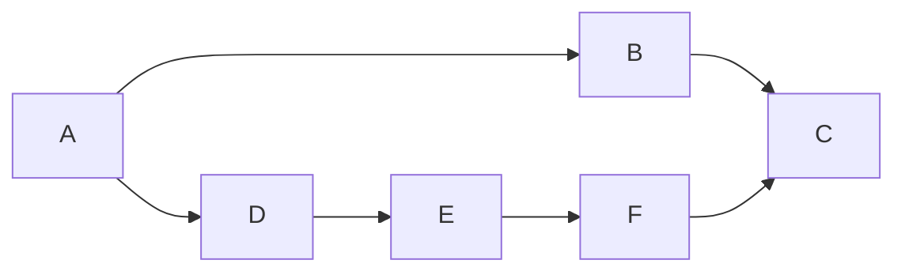

# TASK 2: 위상 정렬 이해 및 구현

**학습 범위**: Chapter 9.2 — Topological Sort  
**학습 교재**: *Data Structures and Algorithm Analysis in C++ (4판)*  
**목적**: 그래프 알고리즘에 대한 심층적 이해 및 위상 정렬 구현 능력 습득  

---

## 핵심 활동

### 1. DAG (Directed Acyclic Graph) 개념 이해

- 방향이 있으며, **사이클이 존재하지 않는 그래프**  
- 위상 정렬은 DAG에서만 수행 가능  
- 사이클이 있다면 어떤 정점도 모든 의존을 충족시킨 순서를 구성할 수 없음

**시각적 예시 (Mermaid 그래프)**:



- 이 그래프는 방향성이 있고 사이클이 없습니다.
- 따라서 위상 정렬이 가능합니다.

---

### 2. DFS 기반 위상 정렬 알고리즘

**DFS (Depth-First Search, 깊이 우선 탐색) 간단 설명**:  
- 한 정점에서 시작해 인접한 정점을 따라 깊게 방문하는 그래프 탐색 방법입니다.  
- 스택 또는 재귀를 활용하며, 탐색 경로의 깊이를 우선으로 진행합니다.  
- 사이클 검출, 경로 탐색 등에 자주 사용됩니다.

**알고리즘 흐름**:
1. 방문하지 않은 정점 v에 대해 DFS 수행
2. 자식 정점들 모두 방문 완료 후 **v를 결과 리스트의 맨 앞에 추가**
3. 모든 정점에 대해 반복

**코드 요약 (의사코드)**:
```cpp
void dfs(int v) {
    visited[v] = true;
    for (int w : adj[v])
        if (!visited[w]) dfs(w);
    result.push_front(v);  // 후위순회 결과
}
```

**특징**:
- DFS 후위순회 결과를 거꾸로 정렬 → 위상 정렬 결과
- 시간 복잡도: **O(V + E)**

---

### 3. 큐 기반 위상 정렬 (Kahn의 알고리즘)

**알고리즘 흐름**:
1. 모든 정점의 진입 차수(in-degree) 계산
2. 진입 차수가 0인 정점을 큐에 삽입
3. 큐에서 정점을 꺼내 결과에 추가하고, 연결된 간선 제거 (in-degree 감소)
4. in-degree가 0이 된 정점을 큐에 추가

**코드 요약**:
```cpp
queue<int> q;
for (int v = 0; v < V; ++v)
    if (in_degree[v] == 0) q.push(v);

while (!q.empty()) {
    int v = q.front(); q.pop();
    result.push_back(v);
    for (int w : adj[v])
        if (--in_degree[w] == 0)
            q.push(w);
}
```

**특징**:
- 사이클이 없을 경우에만 모든 정점을 정렬 가능
- 사이클이 있는 경우 → 정렬된 결과의 길이 < 전체 정점 수

---

### 4. 사이클 감지 방법 학습

- **DFS 기반**: DFS 수행 중 방문 중인 정점을 다시 만나면 사이클 존재
- **Kahn 알고리즘**: 결과 정점 개수가 전체 정점 수보다 적으면 사이클 존재

**활용 팁**:
- 위상 정렬 중 순서가 나오지 않는다면 → **순환 의존성 존재** 의미

---

## 심화 요소

### ▶ 여러 가능한 위상 정렬 결과

- DAG에서는 **위상 정렬 결과가 유일하지 않을 수 있음**
- 예:  
```
A → B  
A → C  
```
가능한 결과: A-B-C, A-C-B

### ▶ 응용 사례

| 분야 | 활용 예시 |
|------|-----------|
| 빌드 시스템 | 소스 코드 의존성 분석 |
| 작업 스케줄링 | 선후 관계가 있는 작업 자동 정렬 |
| 컴파일러 | 기호 해석, 선언-사용 관계 처리 |
| 교육 과정 추천 | 선수과목 관계에 따른 이수 순서 추천 |

---


이 문서는 위상 정렬의 핵심 개념과 구현 전략을 중심으로 구성되었습니다.
